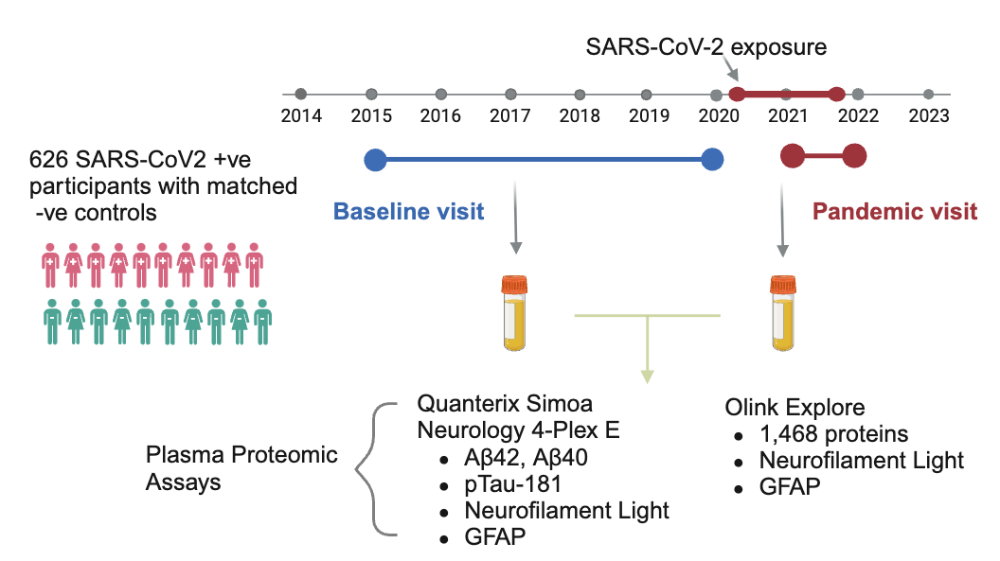

# BIACOB (Brain Injury After COVID-19 infection Biomarker Study)

Code repository for [Plasma proteomic evidence for increased β-amyloid pathology after SARS-CoV-2 infection](https://www.medrxiv.org/content/10.1101/2024.02.02.24302132v2)

* Eugene P Duff, Henrik Zetterberg, Amanda Heslegrave, Abbas Dehghan, Paul Elliott, Naomi Allen, Heiko Runz, Rhiannon Laban, Elena Veleva, Christopher D Whelan, Benjamin B Sun, Paul M Matthews*

## Code

This repository comprises a Jupiter Notebook and functions used for analysis. 

## Data availability

Access to UK Biobank data requires application. UK Biobank Access Policy and Procedures are available from www.ukbiobank.ac.uk/enable-your-research . 
